# namaste

### Namaste
Bringing you the west coast's best yoga. View site [here](http://namasteyoga.herokuapp.com).

### App Features
&mdash; search for yoga classes  
&mdash; view all studios by location  
&mdash; rate yoga classes and studios  
&mdash; view tweets about studios  
&mdash; edit profile (admin only)  
&mdash; add classes and studios (admin only)

### Technologies Used
&mdash; Laravel / MVC  
&mdash; PHP / HTML / CSS  
&mdash; Bootstrap CSS  
&mdash; HTML forms  
&mdash; MySQL database  
&mdash; Blade templating  
&mdash; Eloquent ORM  
&mdash; Eager loading  
&mdash; Twitter API  
&mdash; Laravel's Cache class

### Demo

[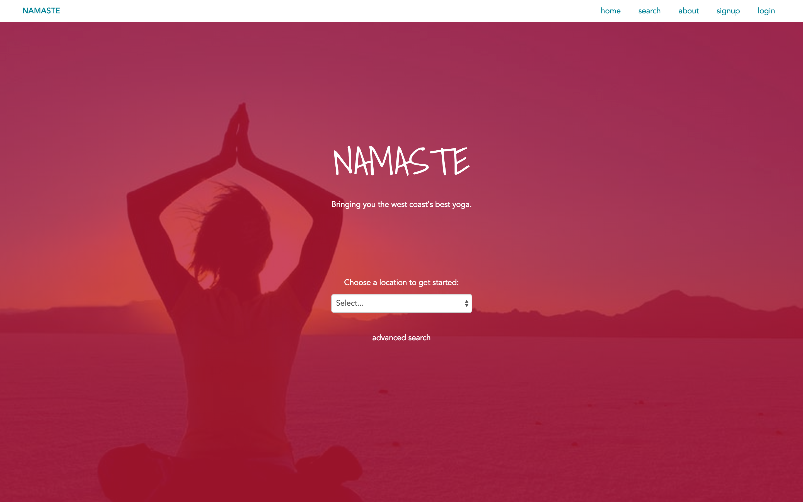](https://vimeo.com/126330551)

### Screenshots

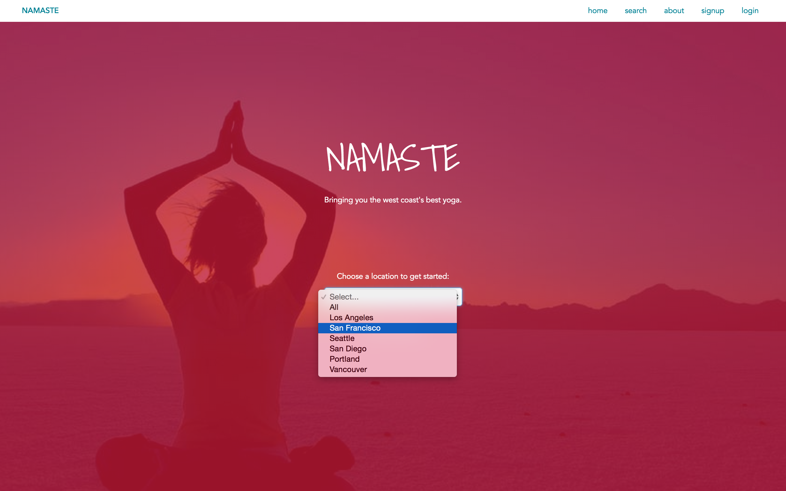
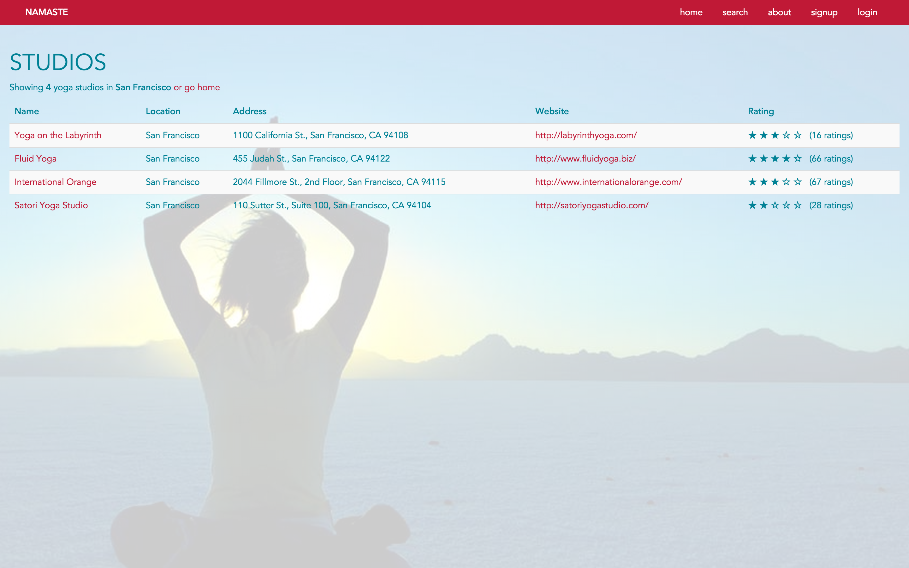
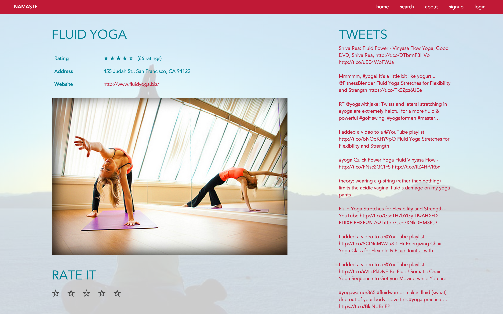
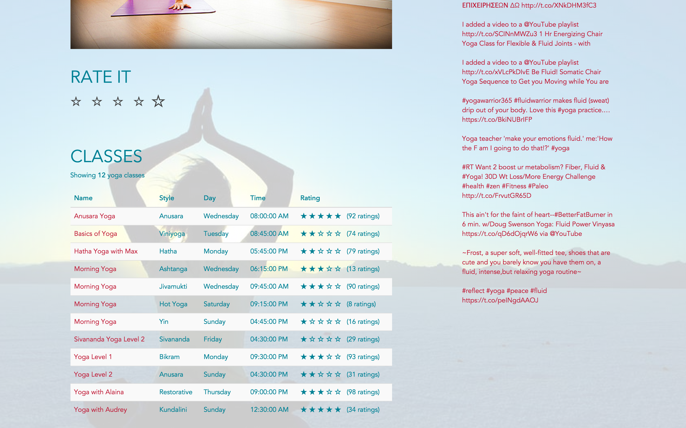
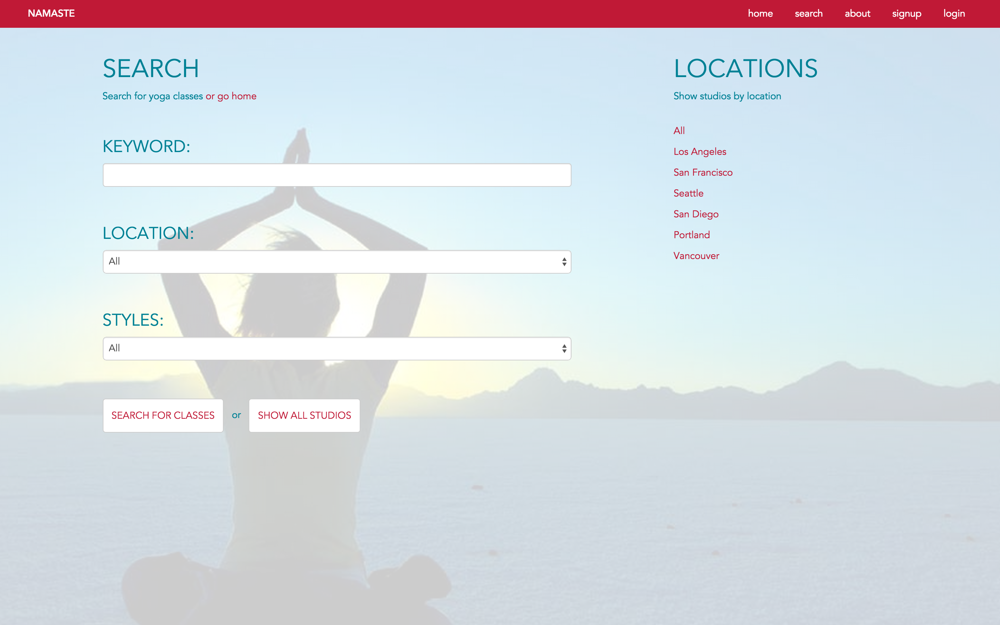
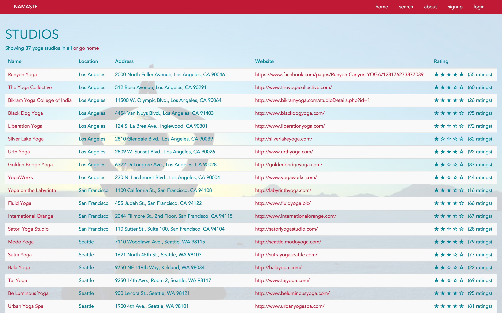
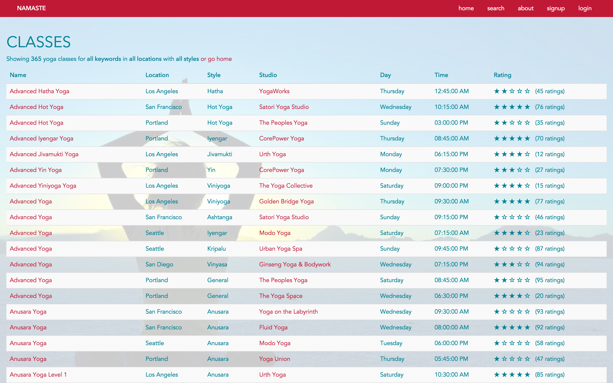
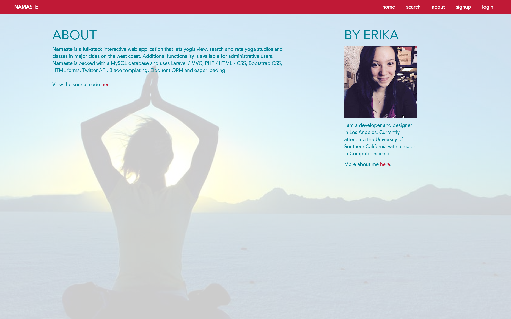
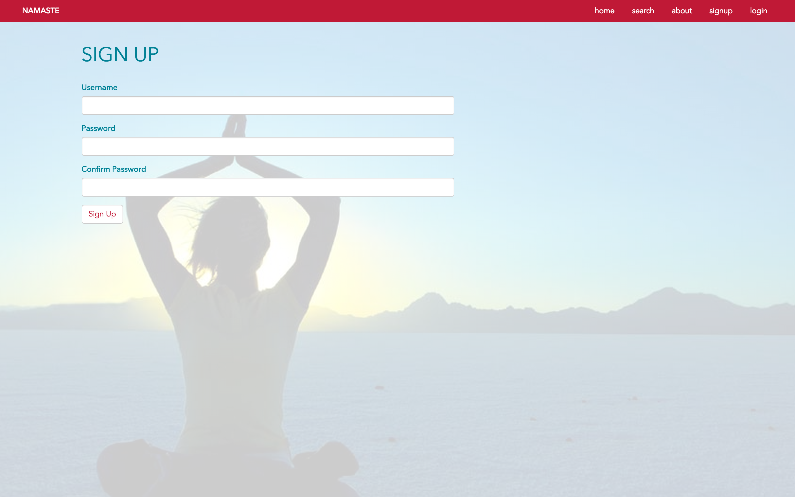
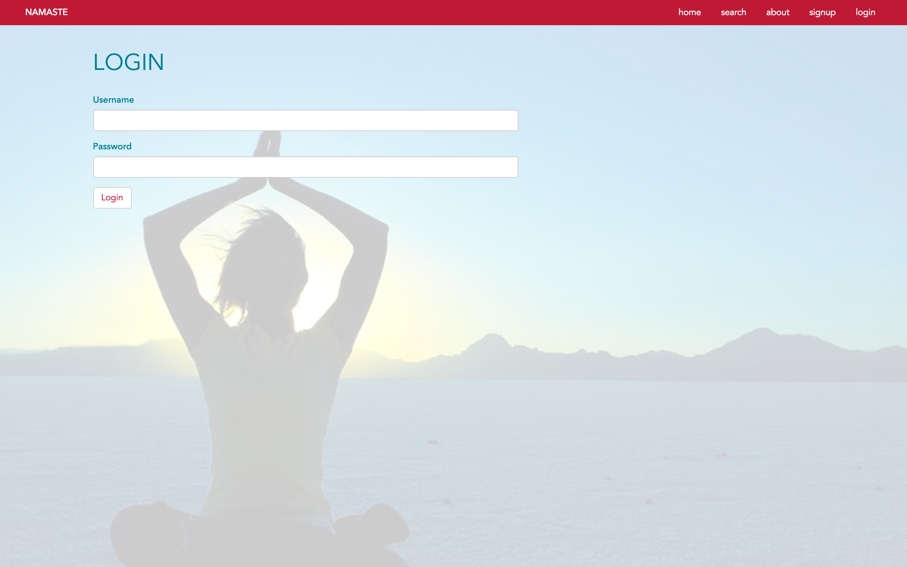

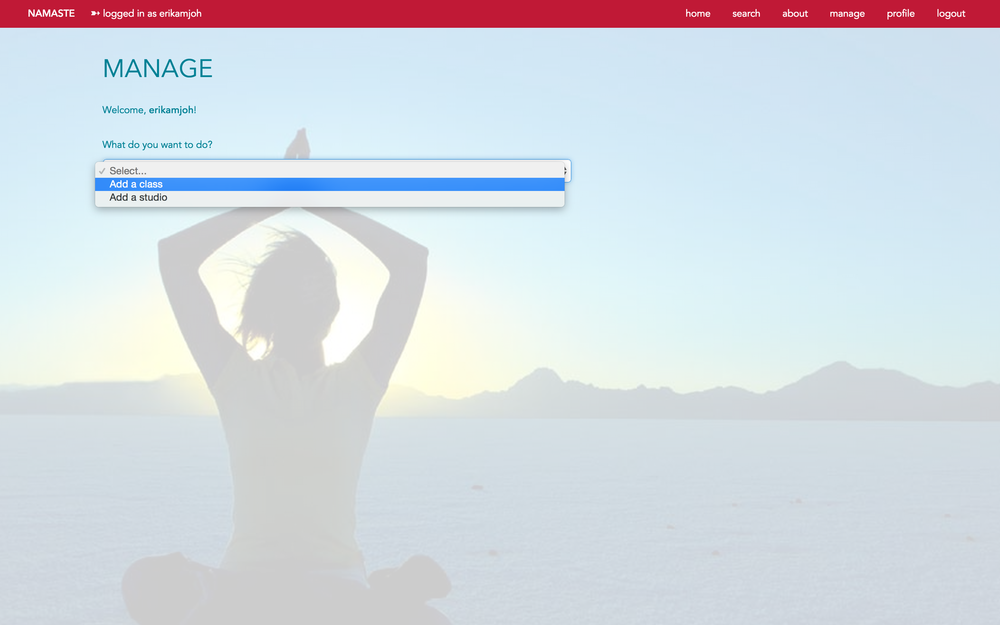
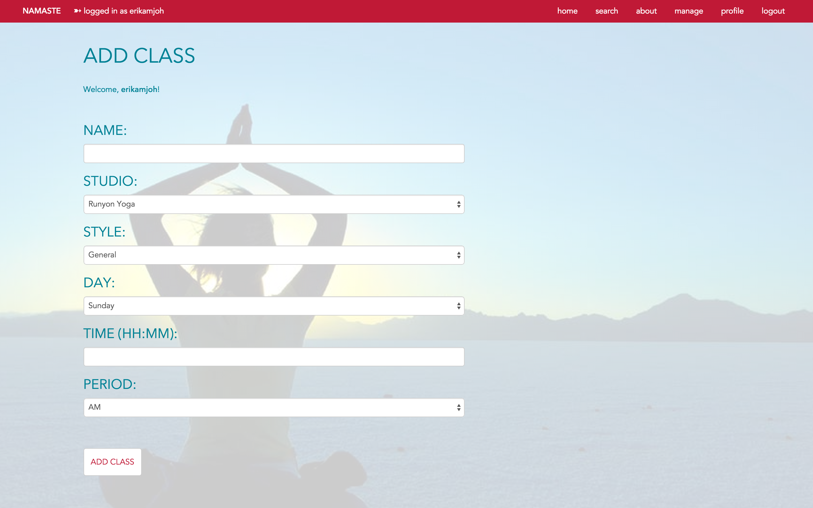
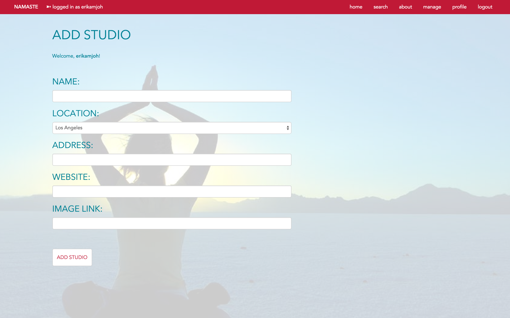
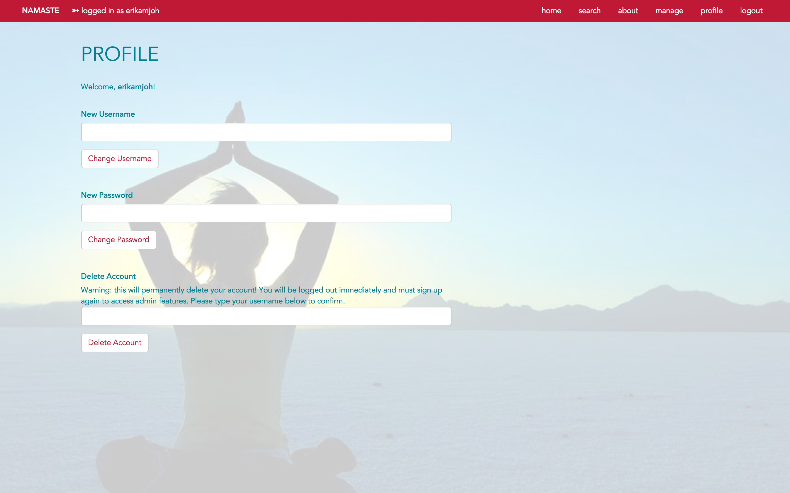